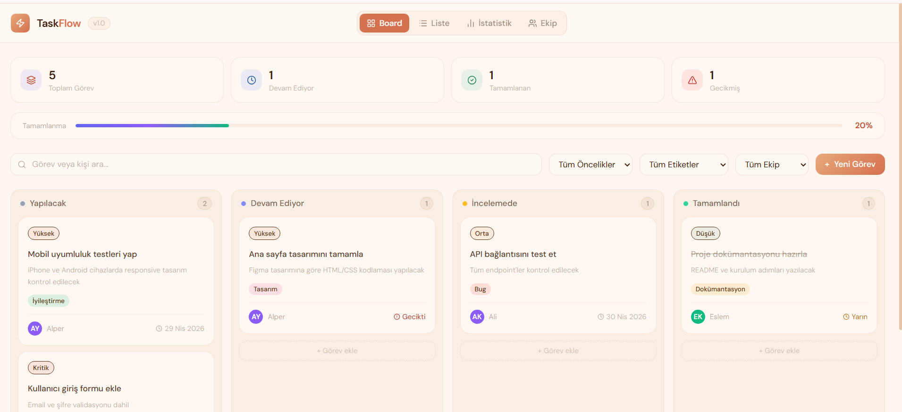
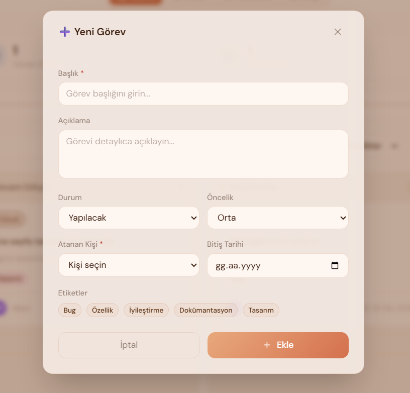
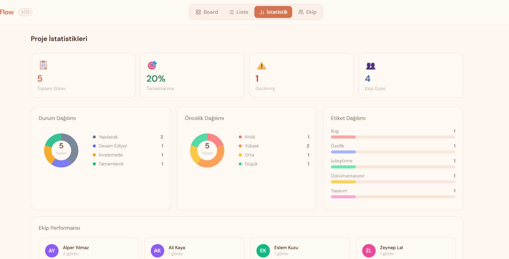
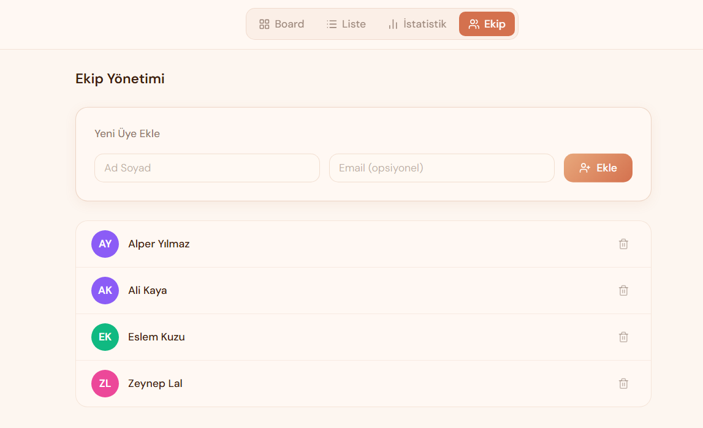

# TaskFlow 🚀

React ile geliştirilmiş modern görev yönetimi uygulaması.

## 🔗 Canlı Demo
https://glowing-bunny-5db461.netlify.app

## ✨ Özellikler

- 📋 Kanban Board — sürükle bırak ile görev taşıma
- 📝 Liste Görünümü — tablo halinde görev takibi
- 📊 İstatistik Sayfası — durum/öncelik grafikleri, ekip performansı
- 👥 Ekip Yönetimi — üye ekle/sil, görev ata
- ✅ CRUD İşlemleri — ekle, listele, güncelle, sil
- 🔍 Filtreleme — öncelik, etiket ve kişiye göre filtrele
- ☁️ Firebase — gerçek zamanlı veritabanı

## 🛠️ Kullanılan Teknolojiler

- React 18
- Vite
- Tailwind CSS
- Firebase (Firestore)
- Lucide React
- Context API

## 🚀 Kurulum

```bash
npm install
npm run dev
```

## 📸 Ekran Görüntüleri




